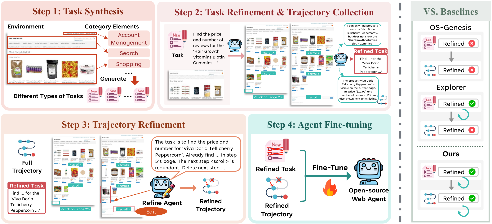

<div>
<h2 align="center"><a href="https://arxiv.org/pdf/2511.06101"> Adapting Web Agents with Synthetic Supervision</a></h2>

<p align="center">
  <a href="https://github.com/Raibows">Zhaoyang Wang<sup>1,3</sup></a>,
  <a href="https://github.com/plzdoo">Yiming Liang<sup>2</sup></a>,
  <a href="https://xuczhang.github.io/">Xuchao Zhang<sup>3</sup></a>,
  <a href="https://qianhuiwu.github.io/">Qianhui Wu<sup>3</sup></a>,
  <a href="https://lillianwei-h.github.io/">Siwei Han<sup>1</sup></a>,<br/>
  <a href="https://www.microsoft.com/en-us/research/people/ansonbastos/">Anson Bastos<sup>3</sup></a>,
  <a href="https://www.microsoft.com/en-us/research/people/rujiawang/">Rujia Wang<sup>3</sup></a>,
  <a href="https://www.microsoft.com/en-us/research/people/chetanb/">Chetan Bansal<sup>3</sup></a>,
  <a href="https://www.microsoft.com/en-us/research/people/baolinpeng/">Baolin Peng<sup>3</sup></a>,
  <a href="https://www.microsoft.com/en-us/research/people/jfgao/">Jianfeng Gao<sup>3</sup></a>,
  <a href="https://www.microsoft.com/en-us/research/people/saravar/">Saravan Rajmohan<sup>3</sup></a>,
  <a href="https://www.huaxiuyao.io/">Huaxiu Yao<sup>1</sup></a>
</p>
<p align="center">
  <sup>1</sup>UNC-Chapel Hill &nbsp; <sup>2</sup>Purdue University &nbsp; <sup>3</sup>Microsoft
</p>
</div>
<p align="center">
  <a href="https://arxiv.org/pdf/2511.06101" target="_blank">Paper (arXiv)</a>&nbsp;&nbsp;
  HuggingFace (coming soon)
</p>

## Overview
<div align="center">
    
</div>
SynthAgent is a framework for adapting web agents to any new environments using synthetic supervision. It efficiently synthesizes diverse user tasks by categorized exploration. Then, it refines these tasks during trajectory collection to mitigate hallucinations. After collection, it refines the trajectories to enhance the data quality. Finally, it utilizes refined data to fine-tune the agent, improving the performance in the target new environment.

## Quick Start
**‼️We plan to release the refined data and fine-tuned models, so you can freely use the data and agents without going through the whole pipeline. Stay tuned!**

## Requirements

### Environment
1. SynthAgent can be deployed in any web environments. To replicate our experiments, please refer to [WebArena](https://github.com/web-arena-x/webarena) to setup the docker-based web environment. You also need to clone the repo at the same level as this repo:
    ```bash
    git clone https://github.com/web-arena-x/webarena.git webarena-official

    # the directory structure should be like this:
    .
    ├── SynthAgent (this repo)
    └── webarena-official
    ```

2. To fine-tune the model, we use [LLaMA-Factory==0.9.4.dev0](https://github.com/hiyouga/LLaMA-Factory) for SFT training. We recommend using another python environment for its setup.

3. For evaluation, we use [vLLM==0.10.1.1](https://github.com/vllm-project/vllm) for serving the fine-tuned models. Please prepare another environment for installation.


### Python Dependencies
```bash
# create conda env
conda create -n synthagent python=3.10 -y
conda activate synthagent
pip install uv

# install webarena requirements
uv pip install -r webarena-official/requirements.txt
uv pip install simpleArgParser huggingface-hub transformers==4.55.4 datasets loguru tqdm openai==1.86.0 tokenizers opencv-python playwright==1.32.1 Pillow fastapi uvicorn scikit-learn json5 ipykernel matplotlib json-repair qwen_vl_utils
uv pip install -e webarena-official

# install playwright for browser automation
playwright install

# install our repo
uv pip install -e SynthAgent

# required by webarena eval
python -c "import nltk; nltk.download('punkt_tab')"

# install pytorch cpu for converting data into LLaMA-Factory training format
uv pip install torch torchvision --index-url https://download.pytorch.org/whl/cpu
```

## Step 1: Task Synthesis
Before running everything, please ensure the WebArena environment is running properly. You may also need to configure the environment ports to satisfy:
```
shopping_port = base_port
shopping_admin_port = base_port + 1
reddit_port = base_port + 2
gitlab_port = base_port + 3
wikipedia_port = base_port + 4
map_port = base_port + 5
```
Otherwise, you can modify `syn/args.py/EnvConfig` to fit your port configuration for each website.

To collect environment-specific tasks for the five websites:
```bash
envs=(map shopping shopping_admin reddit gitlab)
for i in "${!envs[@]}"; do
    python synthagent.py --target_env ${envs[$i]} --env_start_port 10000 --synth_until_tasks 500 --openai_api_key "your_openai_api_key"
done
```
where `--env_start_port` is the base port (shopping_port) of your WebArena environment.

The synthesized tasks will be saved in `outputs/synthagent`. Merge these tasks by:
```bash
python convert_tasks.py --start_folder outputs/synthagent --output configs/synthagent.jsonl
```

## Step 2: Task Refinement
We perform task refinement during trajectory collection to mitigate potential hallucinations in task synthesis.
```bash
python multi_exeagent.py \
--num_processes 8 \
--tasks_path configs/synthagent.jsonl \
--ignore_start_url yes \
--env_start_port 11000 \
--refine yes \
--gpt.model gpt-4.1 \
--gpt.openai_api_key "your_openai_api_key"
```

The refined tasks and collected trajectories will be saved in `outputs/exeagent/webarena/synthagent.xxxx`.

## Step 3: Trajectory Refinement
The collected trajectories may contain noise due to imperfect agent execution. We further refine the trajectories to enhance data quality by
```bash
python scoreagent.py --input outputs/exeagent/webarena/synthagent.xxxx --openai_api_key "your_openai_api_key"
```

The suggested refinements will be saved in the same folder.

## Step 4: Agent Fine-tuning
[LLaMA-Factory](https://github.com/hiyouga/LLaMA-Factory) is used to fine-tune the agent. We provide a script to convert the data into its required format:
```bash
python convert_data.py --input outputs/exeagent/webarena/synthagent.xxxx --output /path/to/llama-factory/data/synthagent.json
```

Then, you can finish the SFT fine-tuning following the config [here](https://github.com/hiyouga/LLaMA-Factory/blob/main/examples/train_full/qwen2_5vl_full_sft.yaml).

## Evaluation
[vLLM](https://github.com/vllm-project/vllm) is used to serve the fine-tuned model for openai-compatible API. Evaluate the model by:
```bash
python multi_exeagent.py \
--num_processes 8 \
--tasks_path configs/webarena.jsonl \
--env_start_port 12000 \
--gpt.model qwen7b \
--openai_api_base http://xxxxx_your_serving_address \
--eval_gpt.model gpt-4.1 \
--eval_gpt.openai_api_key "your_openai_api_key"
```

If you want to evaluate all tasks in WebArena, please use `configs/webarena.750.jsonl`.

Get final accuracy results by `python acc.py --input outputs/exeagent/webarena/webarena.xxxx.folder`.

## Citation
If you find our paper or codes useful, please kindly cite:
```bibtex
@article{wang2025adaptingwebagentssynthetic,
      title={Adapting Web Agents with Synthetic Supervision}, 
      author={Zhaoyang Wang and Yiming Liang and Xuchao Zhang and Qianhui Wu and Siwei Han and Anson Bastos and Rujia Wang and Chetan Bansal and Baolin Peng and Jianfeng Gao and Saravan Rajmohan and Huaxiu Yao},
      year={2025},
      eprint={2511.06101},
      archivePrefix={arXiv},
      primaryClass={cs.LG},
      url={https://arxiv.org/abs/2511.06101}, 
}
```

